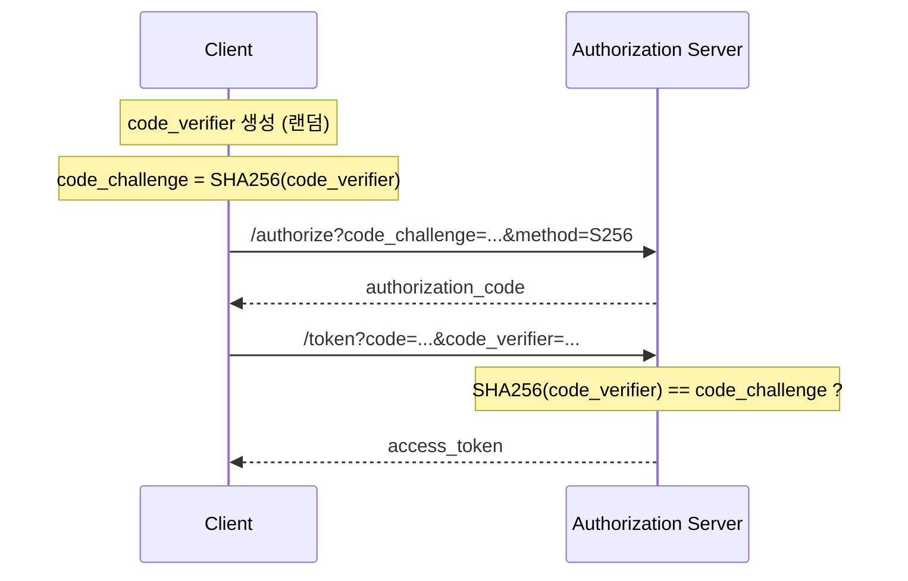

# OAuth 2.1 — OAuth 2.0의 진화

[OAuth 2.1](https://datatracker.ietf.org/doc/draft-ietf-oauth-v2-1/)은 OAuth 2.0(RFC 6749)과 관련 보안 모범 사례를 **하나의 통합 문서**로 정리한 차세대 인가 표준입니다.

2026년 3월 기준 **draft-15** 단계이며, RFC 6749과 RFC 6750을 대체할 예정입니다.

---

## 1. OAuth 2.0 → 2.1 주요 변경점

| 항목 | OAuth 2.0 | **OAuth 2.1** |
|---|---|---|
| **PKCE** | 선택 | ✅ **필수** |
| **Implicit Grant** | 지원 | ❌ **제거** |
| **ROPC Grant** | 지원 | ❌ **제거** |
| **Redirect URI** | 패턴 매칭 가능 | ✅ **정확한 문자열 매칭만** |
| **Bearer Token in URL** | 허용 | ❌ **금지** |
| **Refresh Token** | 무제한 재사용 | ✅ **Rotation 권장** |

---

## 2. 제거된 Grant Types

### Implicit Grant (제거됨)

```
# ❌ 더 이상 사용하지 않음
GET /authorize?response_type=token&client_id=...
# Token이 URL Fragment에 노출됨 → 보안 취약
```

**대안**: Authorization Code + PKCE

### Resource Owner Password Credentials (제거됨)

```
# ❌ 더 이상 사용하지 않음
POST /token
  grant_type=password
  &username=user
  &password=pass
# 클라이언트가 비밀번호를 직접 처리 → 보안 취약
```

**대안**: Authorization Code 또는 Device Authorization Grant

---

## 3. PKCE 필수화

모든 Authorization Code 흐름에서 **PKCE가 필수**입니다.



---

## 4. 보안 강화 사항

### Redirect URI 정확 매칭

```
# ✅ OAuth 2.1
redirect_uri=https://app.com/callback
# 정확히 일치해야 함

# ❌ 더 이상 허용 안 됨
redirect_uri=https://app.com/*
# 패턴 매칭 불가
```

### Bearer Token URL 전달 금지

```
# ❌ 금지됨
GET /api/data?access_token=abc123

# ✅ 반드시 Authorization 헤더 사용
GET /api/data
Authorization: Bearer abc123
```

### Refresh Token Rotation

```
# 매 갱신마다 새로운 Refresh Token 발급
POST /token
  grant_type=refresh_token
  &refresh_token=old_token

# 응답
{
  "access_token": "new_access",
  "refresh_token": "new_refresh",  ← 기존 토큰 무효화
}
```

---

## 5. OAuth 2.0 → 2.1 마이그레이션 체크리스트

- [ ] Implicit Grant 사용 코드 제거
- [ ] ROPC Grant 사용 코드 제거
- [ ] 모든 Authorization Code 흐름에 PKCE 적용
- [ ] Redirect URI를 정확한 문자열로 등록
- [ ] URL 쿼리 파라미터로 토큰 전달하는 코드 제거
- [ ] Refresh Token Rotation 구현

---

> [!IMPORTANT]
> OAuth 2.1은 새로운 기능을 추가하는 것이 아니라,
> **10년간의 보안 모범 사례를 하나의 문서로 통합**한 것입니다.
> 이미 보안 가이드라인을 따르고 있다면 변경이 적을 수 있습니다.
