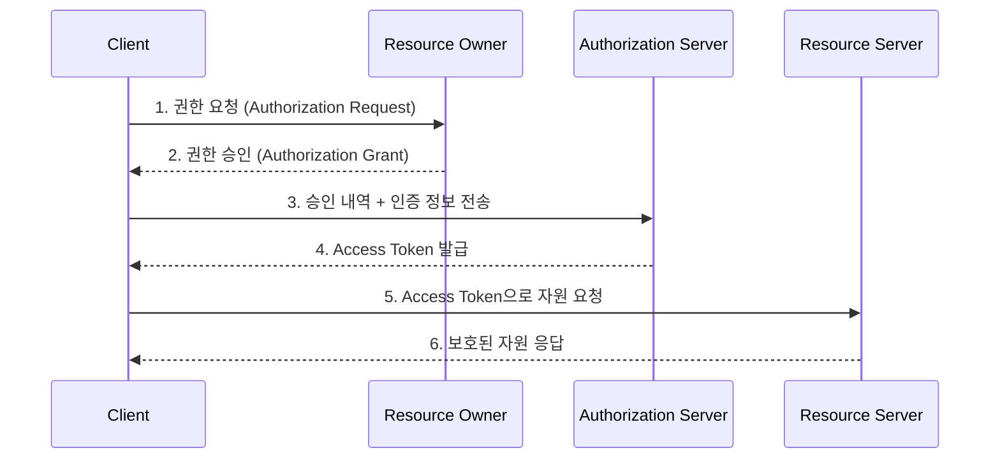

# OAuth 2.0 Authorization Framework

[RFC 6749](https://datatracker.ietf.org/doc/html/rfc6749)는 서드파티 애플리케이션이 HTTP 서비스에 대한 제한된 접근 권한을 얻을 수 있도록 하는 **인가(Authorization) 프레임워크**입니다.

이 문서는 개발자가 반드시 알아야 할 **핵심 역할, 프로토콜 흐름, 4가지 인증 방식(Grant Types)**을 요약합니다.

---

## 1. 주요 역할 (Roles)

OAuth 2.0에는 네 가지 주요 역할이 존재합니다.

1.  **Resource Owner (자원 소유자)**
    *   보호된 자원(내 정보)에 대한 접근 권한을 부여할 수 있는 주체입니다.
    *   보통 **'최종 사용자(User)'**를 의미합니다.

2.  **Resource Server (자원 서버)**
    *   보호된 자원(API)을 호스팅하는 서버입니다.
    *   Access Token을 확인하고 요청을 처리해줍니다. (예: 구글 캘린더 API 서버)

3.  **Client (클라이언트)**
    *   Resource Owner를 대신하여 보호된 자원에 접근을 요청하는 **애플리케이션**입니다.
    *   우리가 개발하는 웹/앱 서비스가 이에 해당합니다.

4.  **Authorization Server (인가 서버)**
    *   Resource Owner를 인증(로그인)하고, 권한 승인을 확인한 후 **Access Token을 발급**해주는 서버입니다. (예: 구글 로그인 서버)

---

## 2. 프로토콜 흐름 (Abstract Protocol Flow)

---

## 3. 권한 부여 방식 (Grant Types)

상황에 따라 4가지 방식 중 하나를 선택해야 합니다.

### (1) Authorization Code Grant (가장 중요 ⭐)
*   **용도**: 서버 사이드 애플리케이션 (웹 서버가 있는 경우)
*   **특징**: 가장 안전하고 널리 쓰입니다. 클라이언트가 바로 토큰을 받지 않고, **'임시 코드(Code)'**를 먼저 받은 뒤 서버끼리 통신하여 토큰으로 교환합니다.
*   **이점**: Access Token이 브라우저(사용자)에게 노출되지 않습니다.

### (2) Implicit Grant
*   **용도**: 브라우저 기반 앱 (SPA), 모바일 앱 (과거 방식)
*   **특징**: 중간 인증 코드 없이 바로 Access Token을 받아옵니다.
*   **주의**: 보안상 취약하여 최근에는 **PKCE(Proof Key for Code Exchange)**를 적용한 Authorization Code Grant 사용을 권장합니다.

### (3) Resource Owner Password Credentials Grant
*   **용도**: 아주 신뢰할 수 있는 앱 (First-party App)
*   **특징**: 사용자의 **아이디/비밀번호**를 클라이언트 앱이 직접 받아서 서버에 보냅니다.
*   **주의**: 클라이언트가 사용자 비밀번호를 알게 되므로, 제3자 앱에서는 절대 사용하면 안 됩니다.

### (4) Client Credentials Grant
*   **용도**: 사용자 개입 없는 시스템 간 통신 (M2M)
*   **특징**: 클라이언트 자신이 자원 소유자인 경우입니다. `client_id`와 `client_secret`만으로 토큰을 받습니다.

---

## 4. 토큰의 종류

### Access Token (접근 토큰)
*   보호된 자원에 접근하기 위한 **열쇠**입니다.
*   보안을 위해 **유효 기간(만료 시간)**이 짧게 설정되는 것이 일반적입니다.
*   Bearer Token 형식을 주로 사용합니다.

### Refresh Token (갱신 토큰)
*   Access Token이 만료되었을 때, 사용자를 다시 로그인시키지 않고 **새 Access Token을 발급받기 위한 용도**입니다.
*   보통 더 긴 유효 기간을 가지며, 보안이 매우 중요한 저장소에 보관해야 합니다.

---

> [!NOTE]
> **Authentication(인증) vs Authorization(인가)**
> OAuth 2.0은 기본적으로 **'인가'**를 위한 프로토콜입니다.
> 사용자가 누구인지 식별(인증)하려면 OAuth 2.0 위에서 동작하는 **OIDC (OpenID Connect)**를 사용해야 합니다.
