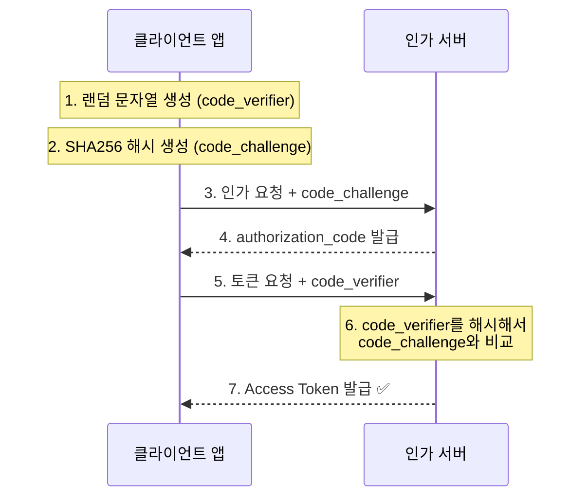

# PKCE (Proof Key for Code Exchange)

[RFC 7636](https://datatracker.ietf.org/doc/html/rfc7636)은 OAuth 2.0의 **Authorization Code 탈취 공격**을 방지하기 위한 보안 확장입니다.
모바일 앱과 SPA(Single Page Application)에서 **필수적으로 적용**해야 합니다.

---

## 1. 왜 필요한가?

### 기존 OAuth 2.0의 취약점
1. 사용자가 로그인 완료 → 앱으로 `authorization_code`가 전달됨
2. **문제**: 악성 앱이 이 코드를 중간에서 가로채면?
3. 악성 앱이 가로챈 코드로 Access Token을 발급받을 수 있음!

### PKCE의 해결책
"이 코드는 **나만 사용할 수 있다**"는 것을 증명하는 메커니즘을 추가합니다.

---

## 2. 동작 원리



### 핵심 아이디어
- 요청 시: **문제(code_challenge)** 전송
- 교환 시: **정답(code_verifier)** 전송
- 정답을 모르면 토큰을 받을 수 없음!

---

## 3. 구현 예시

### 1단계: code_verifier 생성 (43~128자 랜덤 문자열)
```javascript
function generateCodeVerifier() {
  const array = new Uint8Array(32);
  crypto.getRandomValues(array);
  return base64URLEncode(array);
}
```

### 2단계: code_challenge 생성 (SHA256 해시)
```javascript
async function generateCodeChallenge(verifier) {
  const encoder = new TextEncoder();
  const data = encoder.encode(verifier);
  const hash = await crypto.subtle.digest('SHA-256', data);
  return base64URLEncode(new Uint8Array(hash));
}
```

### 3단계: 인가 요청
```
GET /authorize?
  response_type=code&
  client_id=APP_ID&
  code_challenge=E9Melhoa2OwvFrEMTJguCHaoeK1t8URWbuGJSstw-cM&
  code_challenge_method=S256&
  redirect_uri=myapp://callback
```

---

> [!IMPORTANT]
> **2024년 기준 권장사항**  
> OAuth 2.1 초안에서는 **모든 OAuth 클라이언트에 PKCE를 필수로 적용**하도록 권장하고 있습니다. Implicit Grant는 더 이상 권장되지 않습니다.
