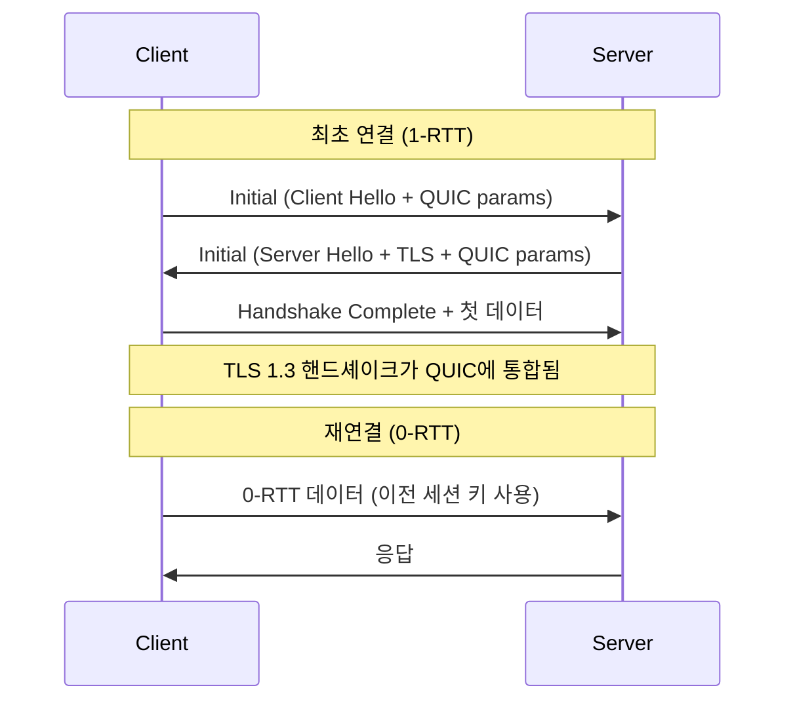

# QUIC — UDP 기반 차세대 전송 프로토콜

[RFC 9000](https://datatracker.ietf.org/doc/html/rfc9000)은 **UDP 위에서 동작하는 다중화 전송 프로토콜**로, HTTP/3의 기반이 됩니다.

Google이 2012년에 실험을 시작하여, 2021년 5월 IETF 표준(RFC 9000)으로 발표되었습니다.

---

## 1. TCP vs QUIC

| 항목 | TCP | QUIC |
|---|---|---|
| **전송 계층** | 커널 레벨 | 유저 스페이스 (UDP 위) |
| **암호화** | 별도 (TLS) | TLS 1.3 내장 |
| **연결 설정** | 3-way + TLS = 2~3 RTT | **1 RTT (0-RTT 가능)** |
| **스트림** | 단일 바이트 스트림 | **독립적 다중 스트림** |
| **HoL Blocking** | ✅ 존재 | **❌ 해결** |
| **연결 식별** | IP + Port 4-tuple | **Connection ID** |
| **NAT 재바인딩** | 연결 끊김 | **끊김 없음** |

---

## 2. QUIC 연결 수립 과정



---

## 3. 핵심 특징

### 독립적 스트림
TCP에서는 하나의 패킷 손실이 후속 모든 데이터를 차단합니다.
QUIC에서는 스트림이 독립적이므로 **스트림 A의 손실이 스트림 B에 영향을 주지 않습니다**.

### Connection ID
IP 주소 변경(Wi-Fi → 셀룰러)에도 **Connection ID가 유지**되어 연결이 끊기지 않습니다.

### 내장 암호화
QUIC은 **모든 페이로드와 대부분의 헤더를 암호화**합니다. 평문 전송이 불가능하여 보안이 강화됩니다.

### 유저 스페이스 구현
커널 업데이트 없이도 **애플리케이션 레벨에서 프로토콜 업데이트**가 가능합니다.

---

## 4. QUIC 패킷 구조

```
QUIC 패킷
├── Header (일부 암호화)
│   ├── Connection ID
│   ├── Packet Number
│   └── Version
├── Frame(s) (완전 암호화)
│   ├── STREAM frame (데이터)
│   ├── ACK frame (확인)
│   ├── CRYPTO frame (핸드셰이크)
│   └── ...기타 제어 프레임
```

---

## 5. 관련 RFC 패밀리

| RFC | 제목 |
|---|---|
| **RFC 9000** | QUIC: A UDP-Based Multiplexed Transport |
| RFC 9001 | Using TLS to Secure QUIC |
| RFC 9002 | QUIC Loss Detection and Congestion Control |
| RFC 9114 | HTTP/3 |
| RFC 9204 | QPACK: Field Compression for HTTP/3 |
| RFC 9221 | QUIC Datagrams |

---

> [!NOTE]
> QUIC은 이론적으로 HTTP뿐만 아니라 **DNS over QUIC(DoQ)**, **WebTransport** 등
> 다양한 프로토콜의 전송 계층으로 활용될 수 있습니다.
