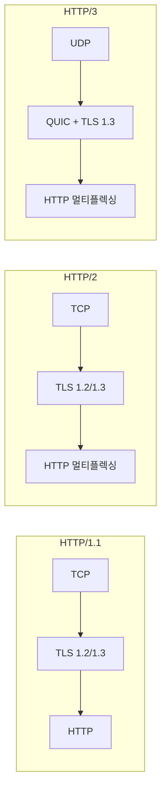

# HTTP/3 — QUIC 기반 차세대 HTTP

[RFC 9114](https://datatracker.ietf.org/doc/html/rfc9114)는 **QUIC 프로토콜** 위에서 동작하는 HTTP의 세 번째 메이저 버전입니다.

2022년 6월에 Proposed Standard로 발표되었으며, 현재 **전체 웹 트래픽의 30% 이상**이 HTTP/3을 사용합니다.

---

## 1. HTTP 버전별 비교



| 항목 | HTTP/1.1 | HTTP/2 | **HTTP/3** |
|---|---|---|---|
| **전송 계층** | TCP | TCP | **UDP (QUIC)** |
| **TLS** | 선택 | 사실상 필수 | **TLS 1.3 내장** |
| **Head-of-Line Blocking** | 요청 레벨 | TCP 레벨 | **❌ 해결** |
| **연결 설정** | 1~3 RTT | 1~3 RTT | **0~1 RTT** |
| **멀티플렉싱** | ❌ | ✅ | ✅ |
| **연결 마이그레이션** | ❌ | ❌ | **✅** |

---

## 2. HTTP/3의 핵심 이점

### 🔹 Head-of-Line Blocking 해결
HTTP/2는 TCP 위에서 멀티플렉싱하므로, 하나의 패킷이 손실되면 **모든 스트림이 차단**됩니다.
HTTP/3(QUIC)은 각 스트림이 독립적이므로 한 스트림의 패킷 손실이 다른 스트림에 영향을 주지 않습니다.

### 🔹 0-RTT 연결 설정
이전에 연결한 적 있는 서버에는 **첫 패킷부터 데이터 전송**이 가능합니다.

### 🔹 연결 마이그레이션
Wi-Fi에서 모바일 데이터로 전환해도 **연결이 끊기지 않습니다**.
QUIC은 IP 주소가 아닌 **Connection ID**로 연결을 식별하기 때문입니다.

---

## 3. HTTP/3 사용 시 고려사항

### 서버 설정

```nginx
# Nginx HTTP/3 설정 예시
server {
    listen 443 quic reuseport;
    listen 443 ssl;

    ssl_protocols TLSv1.3;
    add_header Alt-Svc 'h3=":443"; ma=86400';
}
```

### 클라이언트 지원

| 브라우저 | 지원 |
|---|---|
| Chrome 87+ | ✅ |
| Firefox 88+ | ✅ |
| Safari 14+ | ✅ |
| Edge 87+ | ✅ |

---

## 4. 관련 RFC

| RFC | 제목 | 역할 |
|---|---|---|
| **RFC 9000** | QUIC Transport | 전송 계층 |
| **RFC 9001** | QUIC + TLS 1.3 | 암호화 |
| **RFC 9002** | QUIC Loss Detection | 손실 복구 |
| **RFC 9114** | HTTP/3 | 애플리케이션 계층 |
| **RFC 9204** | QPACK | 헤더 압축 |

---

> [!TIP]
> HTTP/3 도입 시 **방화벽에서 UDP 443 포트를 열어야** 합니다.
> 많은 기업 네트워크에서 UDP가 차단되어 있으므로, HTTP/2 폴백 설정이 필수입니다.
