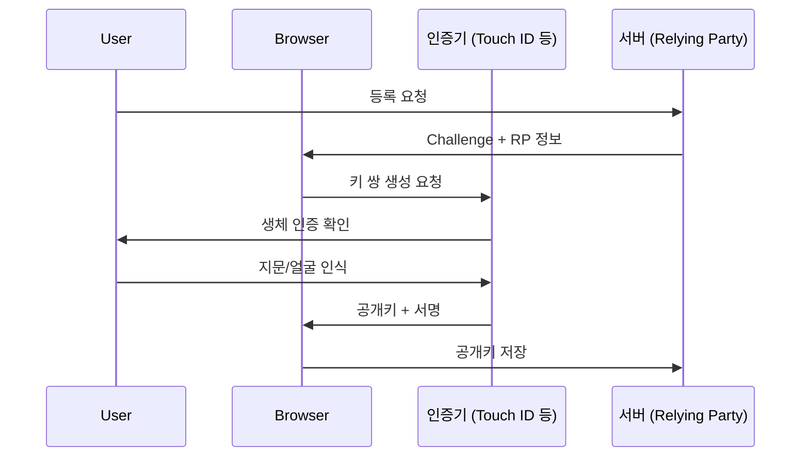
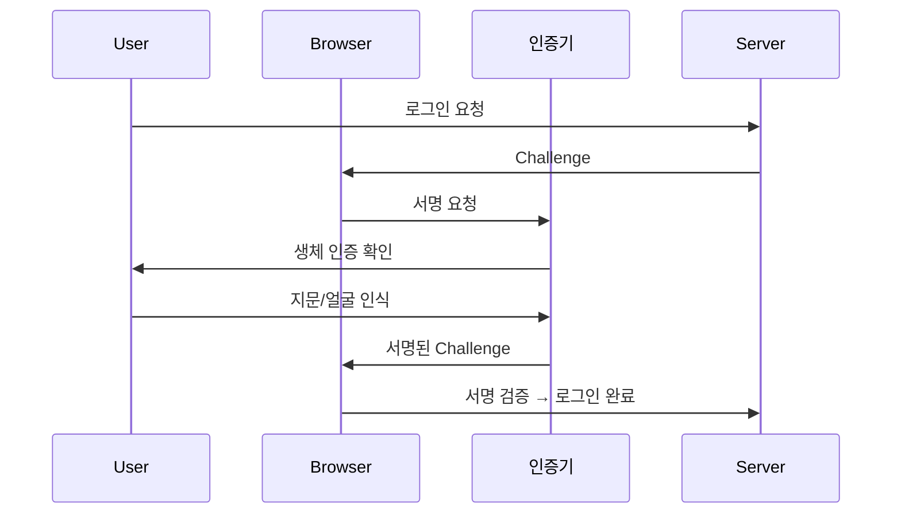

# WebAuthn Level 3 — 패스키 시대의 웹 인증

[Web Authentication API Level 3](https://www.w3.org/TR/webauthn-3/)은 **비밀번호 없는 인증(Passwordless)**을 구현하기 위한 W3C 웹 표준입니다.

2026년 1월 W3C가 구현 초대(CR)를 발표하였으며, **패스키(Passkey)** 시스템의 기반이 됩니다.

---

## 1. 패스키란?

패스키는 **비밀번호를 대체하는 차세대 인증 수단**입니다.

| 항목 | 비밀번호 | **패스키** |
|---|---|---|
| **저장 위치** | 서버 (해시) | 기기 (개인키) |
| **피싱 방어** | ❌ 취약 | ✅ 도메인 바인딩 |
| **유출 시 영향** | 🔴 치명적 | ✅ 공개키만 노출 |
| **사용자 경험** | 기억 필요 | 생체인증/PIN |
| **크로스 디바이스** | 수동 입력 | ☁️ 클라우드 동기화 |

---

## 2. WebAuthn 인증 흐름

### 등록 (Registration)



### 인증 (Authentication)



---

## 3. JavaScript API

### 등록 (navigator.credentials.create)

```javascript
const credential = await navigator.credentials.create({
  publicKey: {
    challenge: new Uint8Array(serverChallenge),
    rp: {
      name: "My App",
      id: "myapp.com"
    },
    user: {
      id: new Uint8Array(userId),
      name: "user@example.com",
      displayName: "사용자"
    },
    pubKeyCredParams: [
      { alg: -7, type: "public-key" },   // ES256
      { alg: -257, type: "public-key" }  // RS256
    ],
    authenticatorSelection: {
      authenticatorAttachment: "platform",  // 기기 내장 인증기
      residentKey: "required",             // 패스키 필수
      userVerification: "required"
    }
  }
});
```

### 인증 (navigator.credentials.get)

```javascript
const assertion = await navigator.credentials.get({
  publicKey: {
    challenge: new Uint8Array(serverChallenge),
    rpId: "myapp.com",
    userVerification: "required"
  }
});

// 서버로 전송하여 검증
await fetch("/api/verify", {
  method: "POST",
  body: JSON.stringify({
    id: assertion.id,
    signature: assertion.response.signature
  })
});
```

---

## 4. Level 3의 새로운 기능

| 기능 | 설명 |
|---|---|
| **조건부 UI** | 자동 완성 필드에 패스키 옵션 표시 |
| **크로스 오리진** | 관련 도메인 간 패스키 공유 |
| **Attestation 개선** | 인증기 유형 확인 강화 |
| **Signal API** | 서버가 인증기 상태를 업데이트 |

---

## 5. 브라우저 / 플랫폼 지원

| 플랫폼 | 패스키 동기화 |
|---|---|
| **Apple** | iCloud Keychain |
| **Google** | Google Password Manager |
| **Microsoft** | Windows Hello |
| **1Password, Dashlane** | 크로스 플랫폼 |

---

> [!TIP]
> 패스키 구현 시 서버 사이드 라이브러리로 **SimpleWebAuthn** (Node.js)이나
> **py_webauthn** (Python)을 사용하면 복잡한 암호화 검증을 간소화할 수 있습니다.
